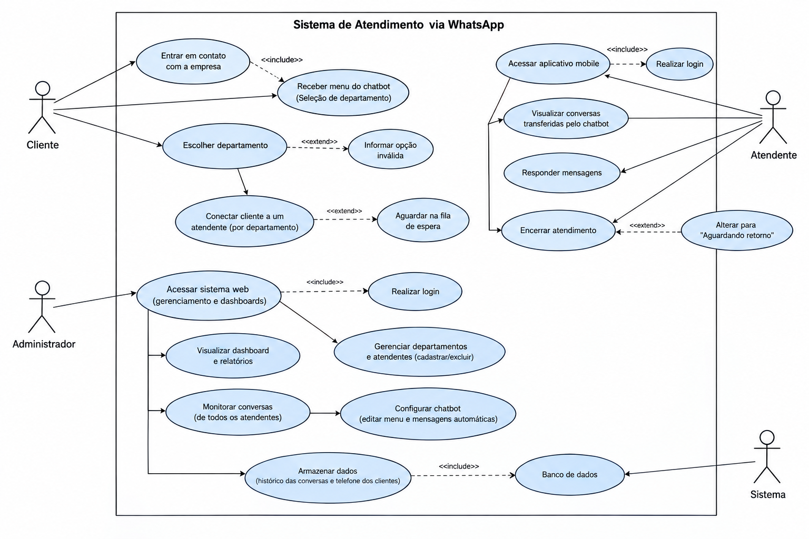

# Documentação de Requisitos
*Membros:* 
* Leonardo Vinicius Galvão da Silva.

## Introdução
Este é um projeto extensionista para o curso de Análise e Desenvolvimento de Sistemas na faculdade PUC de Goiás.

O projeto consiste no desenvolvimento do levantamento de requisitos para um software real, compreendendo as fases de *levantamento de requisitos*, *prototipação*, *apresentação e entrega do projeto*.

## Objetivo Geral do Documento
Este documento tem informações dos requisitos iniciais para concepção de um Sistema de
Gerenciamento e Automatização de mensagens no atendimento ao cliente, utilizando a
API oficial da META.

## Objetivo Geral do Projeto
* Compreender a importância do levantamento de requisitos no ciclo de desenvolvimento de software.
* Aplicar técnicas de elicitação de requisitos para definir funcionalidades de um sistema cliente servidor.
* Utilizar ferramentas para prototipação.
* Trabalhar de forma colaborativa no desenvolvimento do projeto.

## Metodologia utilizada no projeto
* Fase 1 - Levantamento de Requisitos.
    * Aplicação da técnica de *entrevista* para o levantamento dos requisitos.
    * Documentação dos requisitos através do diagrama de uso.
* Fase 2 - Prototipação.
    * Utilização do Figma para a cosntrução do protótipo do sistema.
* Fase 3 - Apresentação e Entrega do Projeto.
    * Documentação final do projeto.
    * Apresentação do sistema desenvolvido (protótipo).

## Propósito Geral do Sistema
* Agilizar o atendimento ao cliente, através de um bot que realizará o atendimento
inicial aos clientes.
* Automatizar as conversas através de mensagens pré-definidas.
* Fornecer um número de Whatsapp que não será bloqueado pela Meta.
* Aumentar as vendas e diminuir a perda por falta ou demora no atendimento.

## Informações do Cliente
O nome do cliente é anônimo, sendo me permitido apenas a identificação do desenvolvedor senior que me acompanhou durante toda a etapa de levantamento de requisitos, que foi quem participou da entrevista respondendo às minhas perguntas.

* *Responsável:* Arthur Freitas.
* *Função:* engenheiro de software senior.
* *Assinatura:* 

## Requisitos do sistema

#### Perguntas utilizadas para o levantamento de requisitos
Os requisitos foram levantados através de uma entrevista com o desenvolvedor senior do projeto. Algumas perguntas foram feitas depois, durante converas, porém não foram documentadas (foram espontâneas).

* Qual problema vocês querem resolver com o sistema?
* Como funciona o atendimento pelo WhatsApp atualmente?
* Quantas mensagens/atendimentos vocês recebem aproximadamente por dia?
* Quais são os principais tipos de solicitação dos clientes?
* Quais atendimentos podem ser totalmente automatizados?
* Em quais situações obrigatoriamente deve entrar um atendente humano?
* Como deve funcionar o encaminhamento para os atendentes?
* Quantos atendentes e setores utilizarão o sistema?
* O sistema deverá apenas responder mensagens ou também iniciar conversas com clientes?
* Quais mensagens automáticas precisam ser enviadas?
* Quais informações do cliente precisam ser armazenadas?
* Existe algum sistema atual que precisamos integrar?
* Quais relatórios e informações a empresa precisa acompanhar?

### Requisitos Funcionais
* RF01 — Dashboard e relatórios
O sistema web deverá permitir ao administrador visualizar um dashboard contendo relatórios sobre os atendimentos por departamento e por atendente, incluindo quantidade de atendimentos, tempo de resposta entre mensagens e tempo entre o início e o encerramento do atendimento.

* RF02 — Filtro de período
O sistema deverá permitir ao administrador selecionar o período dos dados apresentados no dashboard, podendo utilizar períodos em horas, dias ou meses.

* RF03 — Cadastro de departamentos e atendentes
O sistema web deverá permitir ao administrador cadastrar e excluir departamentos e atendentes.

* RF04 — Monitoramento de conversas
O sistema web deverá permitir ao administrador visualizar as conversas de todos os atendentes.

* RF05 — Configuração do chatbot
O sistema web deverá permitir ao administrador configurar o chatbot, incluindo a edição das mensagens padrão do menu e a criação e exclusão de mensagens automáticas.

* RF06 — Autenticação dos atendentes
O sistema deverá permitir que cada atendente acesse o aplicativo mobile utilizando login e senha individuais cadastrados pelo administrador.

* RF07 — Visualização de atendimentos
O aplicativo mobile deverá permitir que o atendente visualize as conversas dos atendimentos direcionados exclusivamente a ele.

* RF08 — Resposta aos clientes
O aplicativo mobile deverá permitir que o atendente responda às mensagens recebidas nos atendimentos direcionados a ele.

* RF09 — Encerramento de atendimento
O aplicativo deverá disponibilizar uma função para o atendente encerrar um atendimento. Após o encerramento, o sistema não deverá permitir o envio de novas mensagens naquele atendimento.

* RF10 — Aguardando retorno
O aplicativo deverá permitir que o atendente altere o atendimento para o status "Aguardando retorno", mantendo-o aberto para posterior continuidade.

* RF11 — Restrição de início de conversa
O sistema não deverá permitir que o atendente inicie uma nova conversa com um cliente. O atendente deverá primeiro receber uma mensagem do cliente para poder respondê-la.

* RF12 — Menu do chatbot
Quando um cliente enviar uma mensagem para a empresa, o chatbot deverá apresentar um menu para seleção do departamento.

* RF13 — Tratamento de opção inválida
Caso o cliente informe uma opção diferente das disponíveis no menu, o chatbot deverá apresentar a mensagem "opção inválida" e exibir novamente o menu.

* RF14 — Distribuição dos atendimentos
O chatbot deverá encaminhar o atendimento para um atendente pertencente ao departamento selecionado pelo cliente.

* RF15 — Fila de atendentes
Quando houver mais de um atendente no departamento selecionado, o sistema deverá encaminhar o atendimento para o próximo atendente da fila, considerando a ordem de login dos atendentes.

* RF16 — Rotação da fila
Após um atendente receber um atendimento, ele deverá ser movido para o final da fila de seu departamento.

* RF17 — Armazenamento de dados
O sistema deverá armazenar o histórico das conversas e o número de telefone dos clientes em um banco de dados.

### Requisitos Não Funcionais
* RNF01 — Plataforma de integração
O sistema deverá utilizar exclusivamente uma API oficial disponibilizada pela Meta para integração com o WhatsApp.

* RNF02 — Aplicação web
A área administrativa deverá ser disponibilizada por meio de uma aplicação web.

* RNF03 — Aplicação mobile
A área destinada aos atendentes deverá ser disponibilizada por meio de um aplicativo mobile.

* RNF04 — Interface gráfica
O aplicativo mobile deverá possuir interface gráfica semelhante à interface do aplicativo oficial do WhatsApp, isso facilitará a adaptação do atendente..

* RNF05 — Restrição de uso
O sistema não deverá disponibilizar funcionalidades destinadas à realização de marketing.

## Diagrama de Casos de Uso

## rascunho
Agentes: cliente, atendente, administrador e sistema.

cliente: entra em contato com a empresa --> sistema responde com um chatbot que retorna um menú para escolher  o departamento --> cliente escolhe o departamento (<<extend>>  caso o cliente insira um departamento inválido, o sistema pede novamente para selecionar um departamento). --> sistema conecta o cliente a um atendente, baseado no departamento escolhido (<<extend>> caso nenhum atendente esteja disponível, ele entra na fila de espera).

administrador: acessa o sistema web para gerenciamento e dashboards (<<include>> precisa fazer login) --> sistema retorna a interface de gerenciamento e dashboards.

atendente: acessa o sistema mobile (<<include>> precisa fazer login) --> sistema mostra as mensagens transferidas pelo chatbot especificamente para esse atendente --> atendente acessas essas conversas e pode responder e encerrar.
